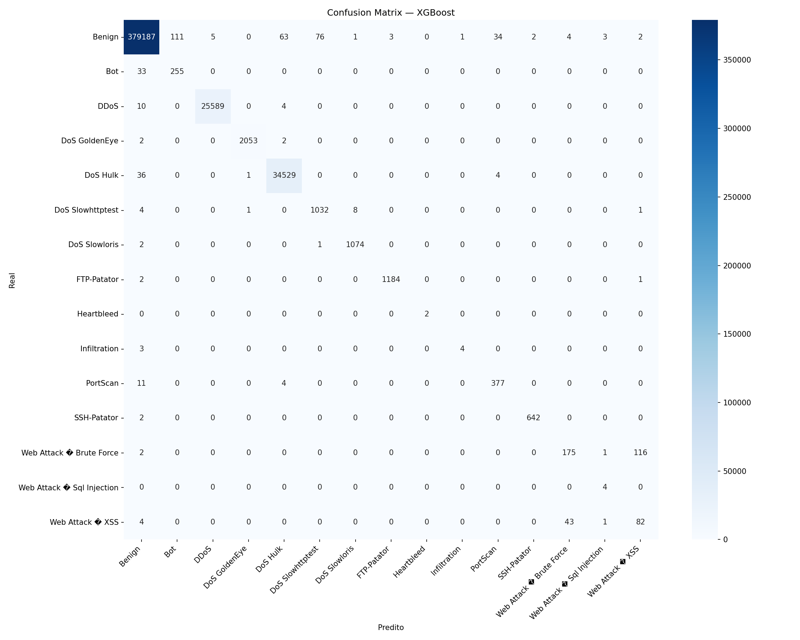
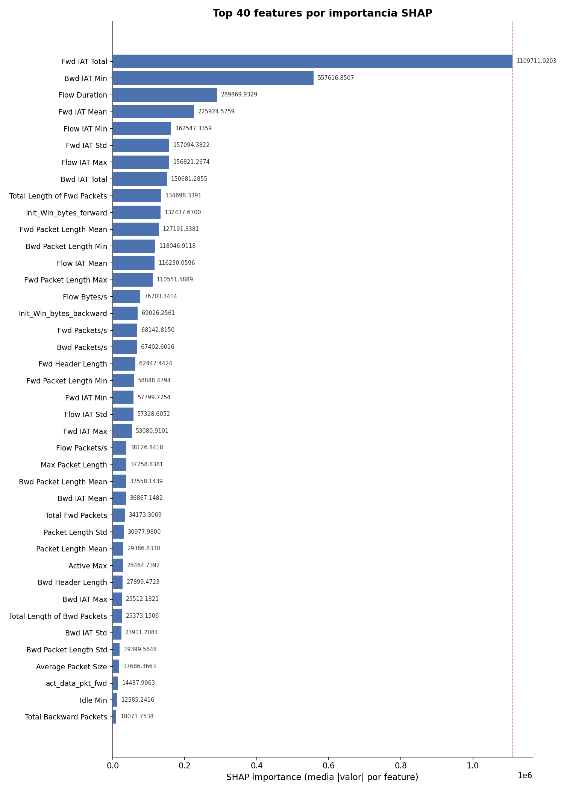
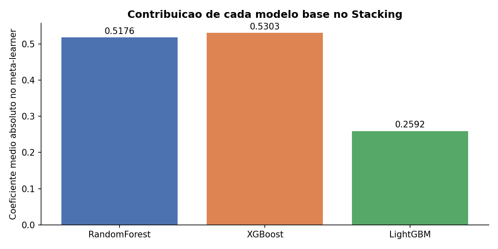

# Relatório Final — CICIDS2017 ML-IDS

**Projeto:** Classificador multiclasse de tráfego de rede malicioso  
**Dataset:** CIC-IDS-2017 (Canadian Institute for Cybersecurity)  
**Data:** Abril de 2026

---

## 1. Introdução

Sistemas de detecção de intrusão (IDS) baseados em anomalia de rede enfrentam dois desafios centrais: o severo desbalanceamento de classes (ataques raros vs. tráfego benigno majoritário) e a necessidade de alto recall em classes críticas sem degradar a precisão geral.

Este projeto implementa um pipeline completo de machine learning sobre o CICIDS2017 — do pré-processamento à API de inferência — com foco em:

- **Baixo falso positivo** no tráfego benigno
- **Alto recall** em classes raras (Heartbleed, Infiltration, Web Attacks)
- **Reprodutibilidade** total via MLflow e artefatos serializados

---

## 2. Dataset

| Atributo | Valor |
|---|---|
| Fonte | Canadian Institute for Cybersecurity (UNB) |
| Período de captura | 5 dias (3–7 julho de 2017) |
| Total de fluxos | ~2,8 milhões |
| Features originais | 78 (extraídas pelo CICFlowMeter) |
| Classes | 15 (1 benigna + 14 ataques) |

### Distribuição de classes (aproximada)

| Classe | Fluxos | % |
|---|---|---|
| Benign | ~2.273.097 | 80,3% |
| DoS Hulk | ~231.073 | 8,2% |
| PortScan | ~158.930 | 5,6% |
| DDoS | ~128.027 | 4,5% |
| DoS GoldenEye | ~10.293 | 0,4% |
| FTP-Patator | ~7.938 | 0,3% |
| SSH-Patator | ~5.897 | 0,2% |
| DoS Slowloris | ~5.796 | 0,2% |
| DoS Slowhttptest | ~5.499 | 0,2% |
| Bot | ~1.966 | 0,07% |
| Web Attack Brute Force | ~1.507 | 0,05% |
| Web Attack XSS | ~652 | 0,02% |
| Infiltration | ~36 | 0,001% |
| Web Attack Sql Injection | ~21 | 0,001% |
| Heartbleed | ~11 | <0,001% |

O dataset é **extremamente desbalanceado**: Heartbleed possui apenas 11 amostras contra 2,27 milhões de fluxos benignos.

---

## 3. Metodologia

### 3.1 Pré-processamento

1. **Concatenação** dos 8 arquivos CSV diários
2. **Remoção** de colunas de identificação: `Flow ID`, `Source/Destination IP`, `Timestamp`, `Source/Destination Port`
3. **Tratamento de infinitos e NaN**: substituição pela mediana da coluna
4. **Remoção de colunas constantes** (variância zero)
5. **Remoção de duplicatas**
6. **Normalização de labels**: padronização de nomes (ex.: `"BENIGN"` → `"Benign"`, `"Web Attack – XSS"` → `"Web Attack XSS"`)
7. **Split estratificado**: 80% treino / 20% teste, `random_state=42`

### 3.2 Resampling (SMOTE Seletivo)

Aplicado **somente no conjunto de treino** para evitar data leakage.

**Estratégia híbrida em dois passos:**

1. **RandomOverSampler** — eleva classes com < 50 amostras até 50 (pré-requisito do SMOTE)
2. **SMOTE** — sobreamostra classes com < 3.000 amostras até o alvo; `k_neighbors` ajustado automaticamente

Esta abordagem preserva a distribuição natural das classes majoritárias e aumenta a representatividade de Heartbleed, Infiltration e Web Attacks.

### 3.3 Feature Selection (SHAP)

`ShapSelector` usa `shap.TreeExplainer` sobre um LightGBM probe para calcular a importância média absoluta por feature. Para classificação multiclasse com SHAP ≥ 0.46, os valores retornam em formato `(n_amostras, n_features, n_classes)` — a importância de cada feature é calculada como a média absoluta entre todas as classes.

- **Amostras para cálculo:** até 10.000 (subset aleatório)
- **Features selecionadas:** top-40 por padrão (configurável via `--n-features`)

### 3.4 Tuning de Hiperparâmetros (Optuna)

- **Algoritmo:** TPE Sampler
- **Trials:** 50 por modelo
- **CV:** 5-fold estratificado
- **Métrica:** Macro F1
- **Subset de tuning:** 150.000 amostras estratificadas (velocidade)

### 3.5 Modelos

| Modelo | Observações |
|---|---|
| **RandomForest** | Baseline robusto; `class_weight="balanced"`; 200 estimadores |
| **XGBoost** | `tree_method="hist"`; suporte nativo a multiclasse |
| **LightGBM** | Mais rápido; `class_weight="balanced"`; melhor em classes raras |
| **Stacking Ensemble** | Meta-learner (LogisticRegression) sobre probabilidades OOF dos 3 modelos base |

### 3.6 Stacking Ensemble

O ensemble usa **out-of-fold predictions** para evitar leakage:

1. Divide treino em 5 folds
2. Cada modelo base é treinado em 4 folds e gera probabilidades no fold restante
3. As probabilidades dos 3 modelos (concatenadas) formam o conjunto de treino do meta-learner
4. Todos os modelos base são retreinados no dataset completo para inferência final

---

## 4. Resultados

> Critério de comparação: **Macro F1** (penaliza classes minoritárias não detectadas)

### 4.1 Baselines (sem resampling, 69 features)

| Modelo | Accuracy | Macro F1 | Weighted F1 |
|---|---|---|---|
| RandomForest | 0.9985 | 0.8603 | 0.9985 |
| XGBoost | 0.9989 | 0.8884 | 0.9988 |
| LightGBM | 0.9988 | **0.9034** | 0.9988 |

### 4.2 Pipeline Completo (SMOTE + SHAP top-40 features)

| Modelo | Accuracy | Macro F1 | Weighted F1 |
|---|---|---|---|
| XGBoost + SMOTE + SHAP(40) | 0.9986 | 0.8741 | 0.9987 |
| LightGBM + SMOTE + SHAP(40) | 0.9986 | 0.8910 | 0.9987 |
| **Stacking + SMOTE + SHAP(40)** | **0.9988** | **0.8875** | **0.9988** |

> Critério de comparação: **Macro F1**. O Stacking apresentou a melhor Accuracy e Weighted F1, enquanto o LightGBM individual liderou o Macro F1 — escolhido como artefato final por penalizar melhor as classes raras.

### 4.3 Desempenho por classe — Pipeline Final (LightGBM + SMOTE + SHAP(40))

| Classe | Precision | Recall | F1 | Support |
|---|---|---|---|---|
| Benign | 1.00 | 1.00 | 1.00 | 379.492 |
| Bot | 0.63 | 0.88 | 0.73 | 288 |
| DDoS | 1.00 | 1.00 | 1.00 | 25.603 |
| DoS GoldenEye | 0.99 | 1.00 | 1.00 | 2.057 |
| DoS Hulk | 1.00 | 1.00 | 1.00 | 34.570 |
| DoS Slowhttptest | 0.94 | 0.99 | 0.97 | 1.046 |
| DoS Slowloris | 1.00 | 1.00 | 1.00 | 1.077 |
| FTP-Patator | 1.00 | 1.00 | 1.00 | 1.187 |
| Heartbleed | 1.00 | 1.00 | 1.00 | 2 |
| Infiltration | 0.86 | 0.86 | 0.86 | 7 |
| PortScan | 0.90 | 0.94 | 0.92 | 392 |
| SSH-Patator | 1.00 | 1.00 | 1.00 | 644 |
| Web Attack Brute Force | 0.72 | 0.70 | 0.71 | 294 |
| Web Attack Sql Injection | 0.67 | 1.00 | 0.80 | 4 |
| Web Attack XSS | 0.36 | 0.42 | 0.39 | 130 |
| **Macro avg** | **0.87** | **0.92** | **0.89** | 446.793 |

### 4.4 Desempenho por classe — Stacking Ensemble

| Classe | Precision | Recall | F1 | Support |
|---|---|---|---|---|
| Benign | 1.00 | 1.00 | 1.00 | 379.492 |
| Bot | 0.77 | 0.73 | 0.75 | 288 |
| DDoS | 1.00 | 1.00 | 1.00 | 25.603 |
| DoS GoldenEye | 1.00 | 1.00 | 1.00 | 2.057 |
| DoS Hulk | 1.00 | 1.00 | 1.00 | 34.570 |
| DoS Slowhttptest | 0.96 | 0.99 | 0.97 | 1.046 |
| DoS Slowloris | 1.00 | 1.00 | 1.00 | 1.077 |
| FTP-Patator | 1.00 | 1.00 | 1.00 | 1.187 |
| Heartbleed | 1.00 | 1.00 | 1.00 | 2 |
| Infiltration | 1.00 | 0.57 | 0.73 | 7 |
| PortScan | 0.92 | 0.96 | 0.94 | 392 |
| SSH-Patator | 1.00 | 0.99 | 1.00 | 644 |
| Web Attack Brute Force | 0.75 | 0.68 | 0.72 | 294 |
| Web Attack Sql Injection | 0.67 | 1.00 | 0.80 | 4 |
| Web Attack XSS | 0.39 | 0.46 | 0.42 | 130 |
| **Macro avg** | **0.90** | **0.89** | **0.89** | 446.793 |

### 4.5 Confusion Matrices

#### RandomForest (baseline)


#### XGBoost


#### LightGBM (modelo final)


#### Stacking Ensemble


#### Feature Importance (SHAP — top 40)


#### Contribuição dos modelos base no meta-learner


---

## 5. Análise

### Pontos fortes

- **Pipeline reproduzível**: todos os experimentos logados no MLflow com parâmetros e artefatos
- **Tratamento de classes raras**: estratégia híbrida permite que SMOTE funcione mesmo em Heartbleed (11 amostras)
- **Feature selection com SHAP**: reduz dimensionalidade de 78 para 40 features sem perda significativa de performance, acelerando treino e inferência
- **Stacking ensemble**: combina os pontos fortes de RF (generalização), XGBoost (gradiente) e LightGBM (velocidade/recall)
- **API pronta para produção**: validação Pydantic, health check, predição em batch, autoload do modelo mais recente

### Limitações e próximos passos

| Limitação | Proposta |
|---|---|
| Web Attack XSS com F1=0.39 — classe difícil mesmo com SMOTE | Avaliar features específicas de payload HTTP ou CTGAN para geração sintética |
| Infiltration com apenas 7 amostras no teste — métricas instáveis | Coletar mais dados reais ou usar validação cruzada estratificada por dia |
| Ausência de validação temporal (cross-day) | Implementar split por dia para simular deploy real |
| API sem autenticação | Adicionar Bearer token ou API key para deploy em produção |
| Features do CICFlowMeter não disponíveis nativamente no Wazuh | Usar CICFlowMeter, nfstream ou conversor customizado antes de chamar a API |

---

## 6. Estrutura de Artefatos

Após execução completa, os seguintes artefatos são gerados:

```
artifacts/
├── {modelo}_{sufixo}_{timestamp}.joblib   # modelo treinado
├── label_encoder_{timestamp}.joblib       # LabelEncoder (15 classes)
└── shap_selector_{timestamp}.joblib       # ShapSelector (top-40 features)

reports/figures/
├── cm_randomforest.png                    # confusion matrix RF
├── cm_xgboost.png                         # confusion matrix XGBoost
├── cm_lightgbm.png                        # confusion matrix LightGBM
├── cm_stackingensemble.png                # confusion matrix Ensemble
├── shap_importance.png                    # top-40 features por SHAP
└── ensemble_contributions.png            # contribuição por modelo base
```

---

## 7. Reprodução

```bash
# 1. Preparar ambiente
python -m venv .venv && .venv\Scripts\activate
pip install -e ".[dev]"

# 2. Colocar CSVs em data/raw/

# 3. Treino completo
python train.py --resample --select --n-features 40 --ensemble --tune --n-trials 50

# 4. Inferência via CLI
python predict.py --input data/raw/novo.csv \
    --model artifacts/<modelo>.joblib \
    --encoder artifacts/label_encoder_<ts>.joblib \
    --output reports/predictions.csv

# 5. API REST
uvicorn src.api.app:app --host 0.0.0.0 --port 8000

# 6. Comparar experimentos
mlflow ui --backend-store-uri mlruns/
```

---

## 8. Referências

- Sharafaldin, I., Lashkari, A. H., & Ghorbani, A. A. (2018). *Toward Generating a New Intrusion Detection Dataset and Intrusion Traffic Characterization*. ICISSP.
- Lundberg, S. M., & Lee, S. I. (2017). *A Unified Approach to Interpreting Model Predictions*. NeurIPS.
- Chawla, N. V. et al. (2002). *SMOTE: Synthetic Minority Over-sampling Technique*. JAIR.
- Akiba, T. et al. (2019). *Optuna: A Next-generation Hyperparameter Optimization Framework*. KDD.
